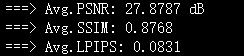
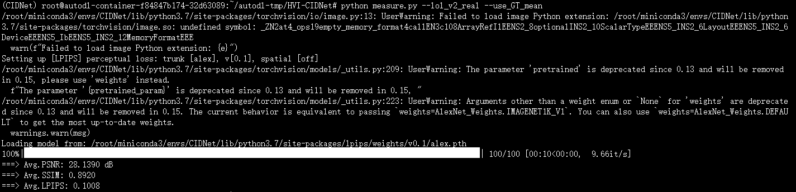
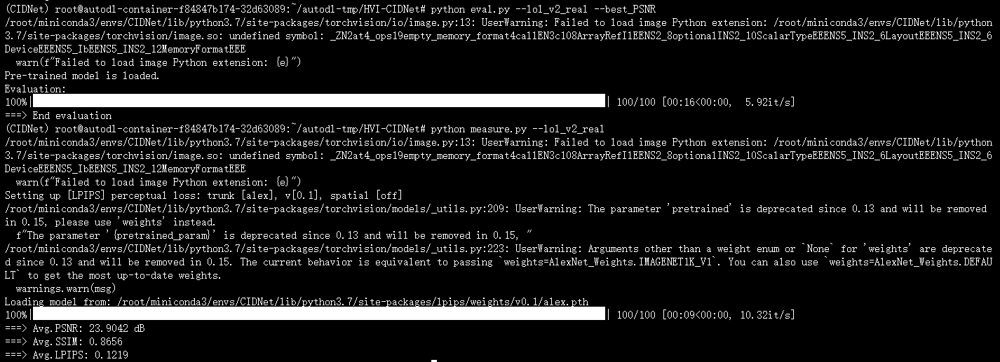
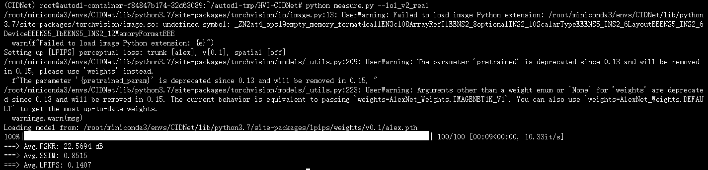

- gt
- P-weight

- train生成的图片→results
- eval生成的图片→output
- measure：指定文件夹和正确文件夹比对
- eval：推理、生成

### eval.py 和 measure.py 的区别

这两个脚本在模型验证流程中扮演不同角色，功能完全不同：

#### 1. **eval.py**（推理/生成阶段）
- **主要功能**：加载训练好的模型，对测试数据集进行推理，生成增强后的输出图像。
- **输入**：
  - 模型权重路径（通过参数选择，如`--best_PSNR`对应`'./weights/LOLv2_real/best_PSNR.pth'`）。
  - 测试数据集路径（硬编码在脚本中，如LOLv1的低光图像）。
- **输出**：增强后的图像，保存到`./output/`文件夹（如`./output/LOLv1/*.png`）。
- **过程**：
  1. 加载模型权重。
  2. 对每张测试图像运行模型推理。
  3. 保存输出图像。
- **使用场景**：当你有模型权重，想生成结果图像时运行。
- **示例命令**：
  ```bash
  python eval.py --lol --best_PSNR  # 生成LOLv1的输出图像
  ```

#### 2. **measure.py**（评估/指标计算阶段）
- **主要功能**：计算输出图像与ground truth之间的质量指标，不涉及模型推理。
- **输入**：
  - 输出图像文件夹路径（`im_dir`，如`'./output/LOLv1/*.png'`）。
  - Ground truth文件夹路径（`label_dir`，如`'./datasets/LOLdataset/eval15/high/'`）。
- **输出**：平均PSNR、SSIM、LPIPS值，打印到控制台。
- **过程**：
  1. 遍历输出图像。
  2. 找到对应的GT图像（文件名匹配）。
  3. 计算每对图像的指标，取平均值。
- **使用场景**：当你已有输出图像，想量化模型性能时运行。
- **示例命令**：
  ```bash
  python measure.py --lol  # 计算LOLv1的指标
  ```

#### 3. **典型工作流程**
1. **训练**：`python train.py`（生成模型权重）。
2. **推理**：`python eval.py`（生成输出图像）。
3. **评估**：`python measure.py`（计算指标）。

#### 4. **关键区别总结**
- **eval**：需要模型，生成图像；**measure**：不需要模型，只计算指标。
- **eval**：输出是图像文件；**measure**：输出是数值指标。
- **eval**：用于生成结果；**measure**：用于量化结果质量。

如果您想验证模型，通常先运行eval.py生成图像，再运行measure.py计算指标。


# 数据记录
- v1-1000，自己的 
- v2，best_GT_mean，官方 
- v2，best_PSNR，官方 
- v2-real-200，自己的 
- 