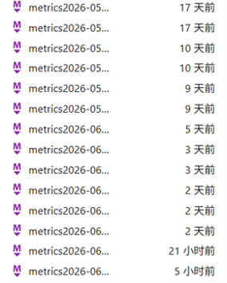
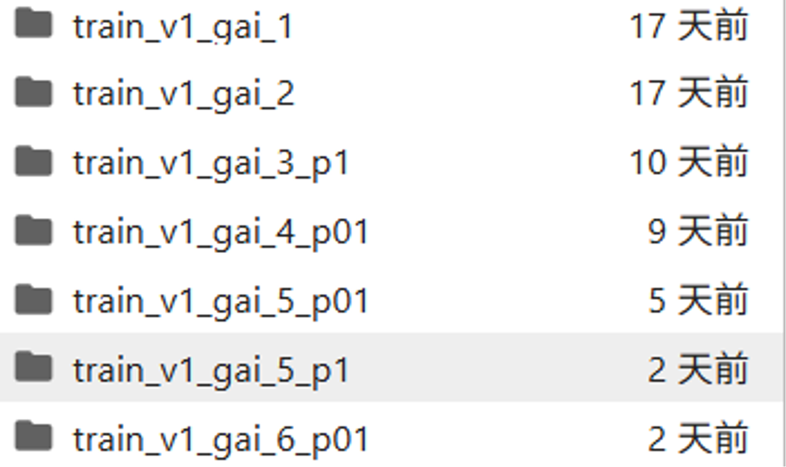

# HVI-CIDNet 复现与改进说明

本文件用于说明本仓库中 HVI-CIDNet 的复现流程、数据集下载地址、训练/推理/评价命令以及本地实验记录。原项目说明见 `Readme.md`，本文档不替代原作者 README，只作为本仓库复现实验的操作入口。

## 1. 项目说明

本仓库基于 HVI-CIDNet 进行复现与改进，任务为低光照图像增强。当前代码中相对原始 HVI-CIDNet 的主要变化包括：

- 在 `net/CIDNet.py` 中加入 `FourierLowPassAttention`，用于亮度分支的频域特征增强。
- 将原网络中的部分跨分支交互模块调整为 `PAB`，并在解码末端加入 `RRB` 以改善细节恢复与亮度不均匀问题。
- 训练损失以 RGB 输出为主，当前 `train.py` 中实际使用：

```text
loss = L1_loss + D_loss + E_loss + P_weight * P_loss
```

默认训练参数以 `data/options.py` 为准，当前默认值包括：

```text
batchSize = 16
cropSize = 256
nEpochs = 600
lr = 2e-4
P_weight = 1e-2
dataset = lol_v1
```

## 2. 环境配置

推荐使用 Conda 环境。原项目推荐 Python 3.7.0 与 PyTorch 1.13.1，本仓库 `requirements.txt` 也固定了对应版本。

```bash
conda create -n hvi-cidnet python=3.7.0 -y
conda activate hvi-cidnet
pip install -r requirements.txt
```

代码默认使用第 0 张 GPU，相关脚本中包含：

```python
os.environ['CUDA_VISIBLE_DEVICES'] = '0'
```

如果显存不足，可以降低 `--batchSize` 或 `--cropSize`。

## 3. 数据集下载

所有数据集下载后放到项目根目录下的 `datasets/`。下表链接来自原 HVI-CIDNet 官方仓库 README。

| 数据集 | 用途 | 下载链接 | 代码默认路径 |
| --- | --- | --- | --- |
| LOLv1 | 配对低光增强训练/测试 | [Official](https://daooshee.github.io/BMVC2018website/) | `datasets/LOLdataset` |
| LOLv2 Real/Synthetic | 配对低光增强训练/测试 | [Baidu Pan](https://pan.baidu.com/s/17KTa-6GUUW22Q49D5DhhWw?pwd=yixu), [OneDrive](https://1drv.ms/u/c/2985db836826d183/EYPRJmiD24UggCmCAQAAAAABEbg62rx0FG21FwLQq0jzLg?e=Im12UA) | `datasets/LOLv2` |
| LOL-Blur | 低光去模糊增强 | [Baidu Pan](https://pan.baidu.com/s/1nj054uoLA3gtpV7MNM2eCA?pwd=yixu), [OneDrive](https://1drv.ms/u/s!AoPRJmiD24UphBTn9PsLC5hoD-k9?e=Jm0AOa) | `datasets/LOL_blur` |
| DICM/LIME/MEF/NPE/VV | 非配对泛化测试 | [Baidu Pan](https://pan.baidu.com/s/1FZ5HWT30eghGuaAqqpJGaw?pwd=yixu), [OneDrive](https://1drv.ms/f/s!AoPRJmiD24UphBNGBbsDmSwppNPf?e=2yGImv) | `datasets/DICM`, `datasets/LIME` 等 |
| SICE | 多曝光增强训练/测试 | [Baidu Pan](https://pan.baidu.com/s/13ghnpTBfDli3mAzE3vnwHg?pwd=yixu), [OneDrive](https://1drv.ms/u/s!AoPRJmiD24UphAlaTIekdMLwLZnA?e=WxrfOa) | `datasets/SICE` |
| Sony-Total-Dark/SID | 极暗场景增强 | [Baidu Pan](https://pan.baidu.com/s/1mpbwVscbAfQJtkrrzBzJng?pwd=yixu), [OneDrive](https://1drv.ms/u/s!AoPRJmiD24UphAie9l0DuMN20PB7?e=Zc5DcA) | `datasets/Sony_total_dark` |
| FiveK | Retinexformer 设置下的训练/测试 | [Baidu Pan](https://pan.baidu.com/s/1ajax7N9JmttTwY84-8URxA?pwd=cyh2), [Google Drive](https://drive.google.com/file/d/11HEUmchFXyepI4v3dhjnDnmhW_DgwfRR/view?usp=sharing) | `datasets/FiveK` |

百度网盘提取码：

```text
LOLv2 / LOL-Blur / DICM-LIME-MEF-NPE-VV / SICE / SID: yixu
FiveK: cyh2
```

## 4. 数据目录结构

最小复现 LOLv1 和 LOLv2 时，需要保证如下结构：

```text
datasets/
  LOLdataset/
    our485/
      low/
      high/
    eval15/
      low/
      high/
  LOLv2/
    Real_captured/
      Train/
        Low/
        Normal/
      Test/
        Low/
        Normal/
    Synthetic/
      Train/
        Low/
        Normal/
      Test/
        Low/
        Normal/
```

其他数据集路径与 `data/options.py` 中默认参数保持一致：

```text
datasets/LOL_blur/
datasets/SICE/
datasets/Sony_total_dark/
datasets/FiveK/
datasets/DICM/
datasets/LIME/
datasets/MEF/
datasets/NPE/
datasets/VV/
```

## 5. 权重下载

如果只做推理和指标复现，可以下载原作者权重：

- 全部权重：[Baidu Pan](https://pan.baidu.com/s/1rvQcQPwsYbtLIYwB3XgjaA?pwd=yixu), [OneDrive](https://1drv.ms/f/s!AoPRJmiD24UpgloqG-S67l1BX0cG?e=0b4GL0)，提取码 `yixu`
- Hugging Face 权重入口：[HVI-CIDNet paper page](https://huggingface.co/papers/2502.20272)

原始 README 中推荐的权重目录结构如下：

```text
weights/
  LOLv1/
    w_perc.pth
    wo_perc.pth
  LOLv2_real/
    best_PSNR.pth
    best_SSIM.pth
    w_perc.pth
  LOLv2_syn/
    w_perc.pth
    wo_perc.pth
    generalization.pth
  LOL-Blur.pth
  SICE.pth
  SID.pth
  fivek.pth
```

注意：当前本仓库的 `eval.py` 中部分权重路径已经被改成本地实验路径，例如 `weights/train-v1-2026-04-17-234005/epoch_1000.pth`。如果使用官方下载权重，需要确认 `eval.py` 中对应分支的 `weight_path` 与实际文件位置一致。

## 6. 训练复现

```bash
python train.py --dataset lol_v1
```

训练输出：

```text
weights/train/epoch_*.pth
results/training/metrics*.md
results/<dataset>/
```
其他相关复现指令
```bash
python train.py --dataset lol_v1 --batchSize 8 --cropSize 256 --nEpochs 1000 --lr 1e-4 --P_weight 1.0 --snapshots 10
```

```bash
python train.py --dataset lolv2_real --batchSize 8 --cropSize 256 --nEpochs 200 --lr 1e-4 --P_weight 1.0 --snapshots 10
```


## 7. 推理生成结果

推理脚本为 `eval.py`，输出默认保存到 `output/`。

### 7.1 LOLv1

当前 `eval.py --lol` 分支使用本地训练权重路径：

```text
./weights/train-v1/epoch_1000.pth
```

运行：

```bash
python eval.py --lol
```

输出：

```text
output/LOLv1/
```

### 7.2 LOLv2-real

使用原脚本中 `best_PSNR` 分支：

```bash
python eval.py --lol_v2_real --best_PSNR
```

输出：

```text
output/LOLv2_real/
```

### 7.3 LOLv2-synthetic

当前 `eval.py --lol_v2_syn` 分支使用本地训练权重路径：

```text
./weights/train-v2-syn-256-001/epoch_210.pth
```

运行：

```bash
python eval.py --lol_v2_syn
```


## 8. 指标评价

在运行 `measure.py` 前，需要先用 `eval.py` 生成对应 `output/` 结果。

### 8.1 配对数据集 PSNR/SSIM/LPIPS

```bash
python measure.py --lol
python measure.py --lol_v2_real
python measure.py --lol_v2_syn
python measure.py --SICE_grad
python measure.py --SICE_mix
python measure.py --fivek
```

如果需要按 GT 平均亮度修正输出：

```bash
python measure.py --lol --use_GT_mean
```


## 9. 参考链接

- HVI-CIDNet 官方仓库：https://github.com/Fediory/HVI-CIDNet
- HVI-CIDNet Hugging Face：https://huggingface.co/papers/2502.20272
- 我们的复现以及改进的代码仓库链接：https://github.com/DeepLearning123456789/HVI-CIDNet

## 10. 改进的权重和指标记录展示

- 每次训练均会记录下改次训练的参数和每10epoch的指标，保存在.md里面:

- 同时保存下该次训练的权重：
